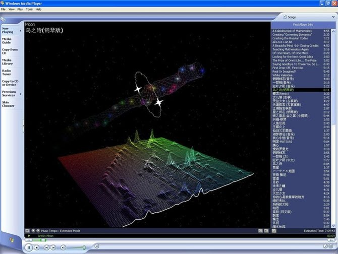
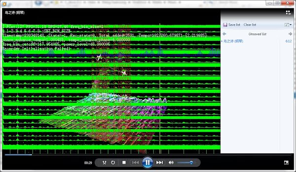

### Music Tempo Visualization for Windows Media Player

This is a visualization plugin for Windows Media Player. It was one of my class project while I was doing my PhD in National University of Singapore.
This program can compute the tempo of a music and track its beats while playing. It draws 3D graphics using OpenGL.

  
  

**How to install**:
1. copy TempoVis.dll into some fixed location (preferably your "\Program Files (x86)\Windows Media Player" folder)
2. Run command prompt with admin right and cd into that folder
3. Run "regsvr32 tempovis.dll". To uninstall, run "regsvr32 /u tempovis.dll"
4. Run your 32-bit Windows Media Player to activate this visualization (currently, only 32-bit wmplayer is supported)

**How to play**:

After you have installed the plugin using regsvr32, you can open Windows Media Player to play any song, right click the now-playing screen, select "visualization" -> "Music Tempo" -> "Extended Mode". The visualization has 4 modes:
* Normal mode:

  the tempo is dynamically computed using the snapshot audio samples by the media player. The estimation is not very accurate because the audio data is incomplete and varies with display frame rate (FPS).

* Extended mode:

  upon loading a new song, the program will decompress the audio file to load the entire music and compute its tempo. The estimation is much more accurate, however, the tempo will be fixed as the algorithm assumes a fixed tempo for every music file.

* Normal/Extended mode (Analysis):
  the program will display all intermediate computation results that is used in determining the final tempo value.

**Mouse Control**:

1. left-button click: toggles FPS and information display
2. middle-button click: reset camera position and rotation speed
3. left-button drag: rotation camera
4. middle-button drag: shift camera
5. text click:
  - when FPS and information display is on, you can click the up arrow at top-left corner to manually switch to fullscreen and back
  - you can also click the numbers in the second row from 0 to 8 to adjust the coverage of the power spectrum display

**The Algorithm**:
I have revised the tempo estimation algorithm recently. By the time when I submitted my project, the algorithm had only ~92% accuracy. Now, it has ~97% accuracy and has much better beat tracking capability. It uses hybrid "filter-bank auto-correlation" and "filter-bank cosine-similarity auto-correlation-gram" algorithm with spectro-gram selection.
